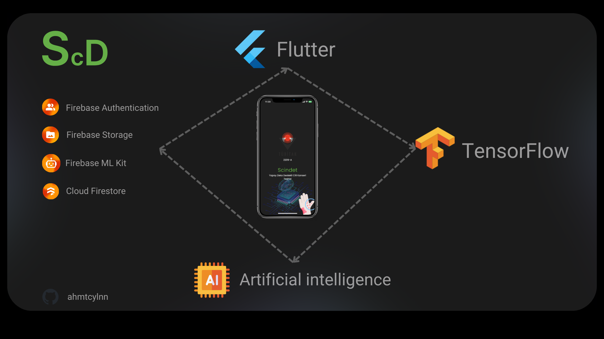
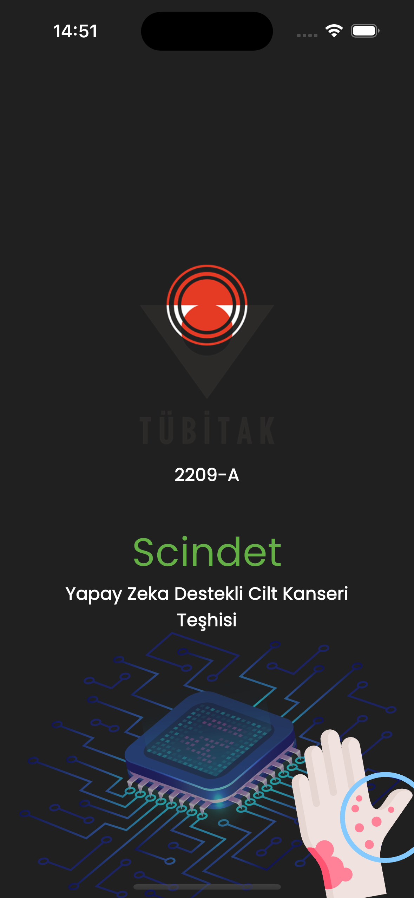
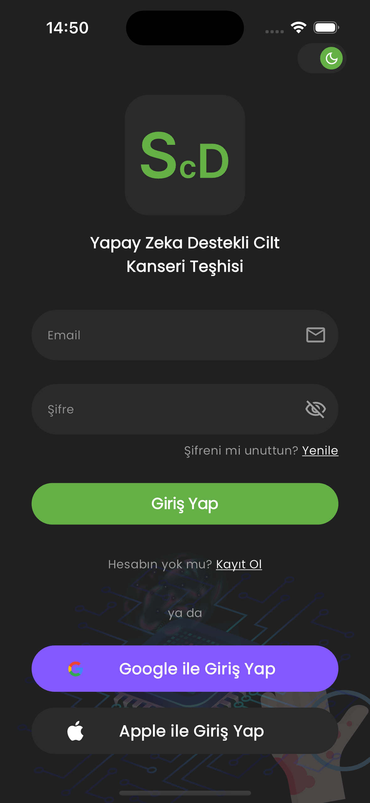
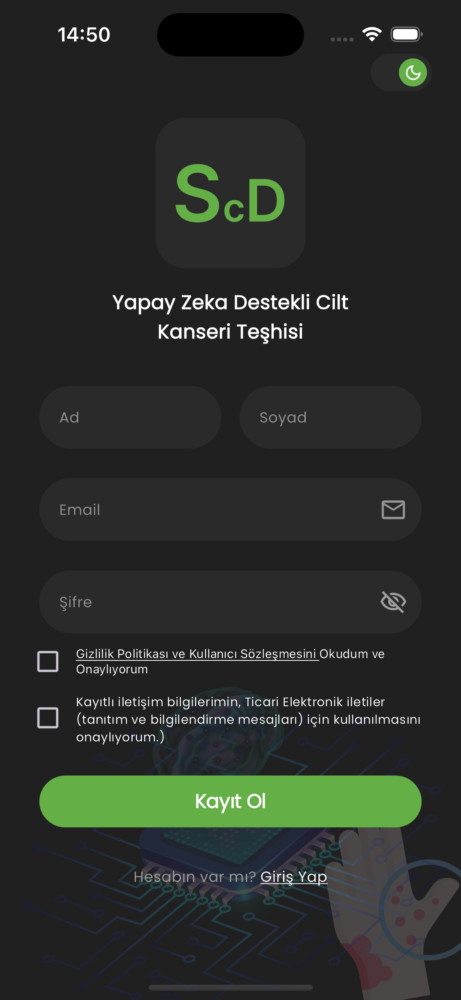
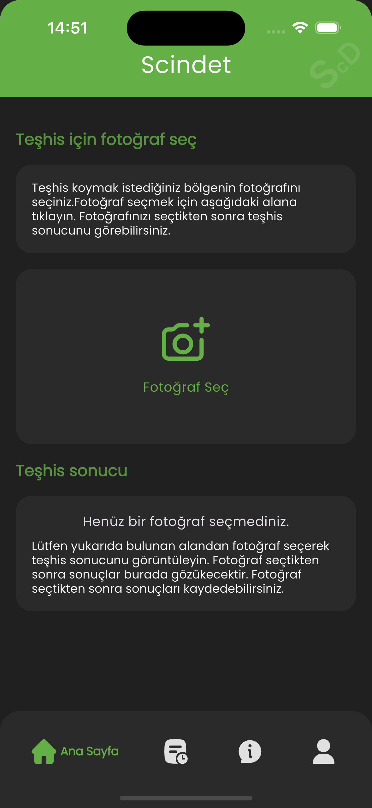
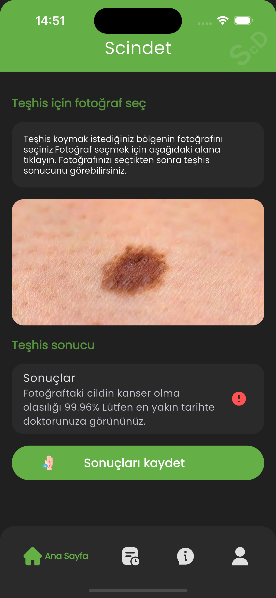
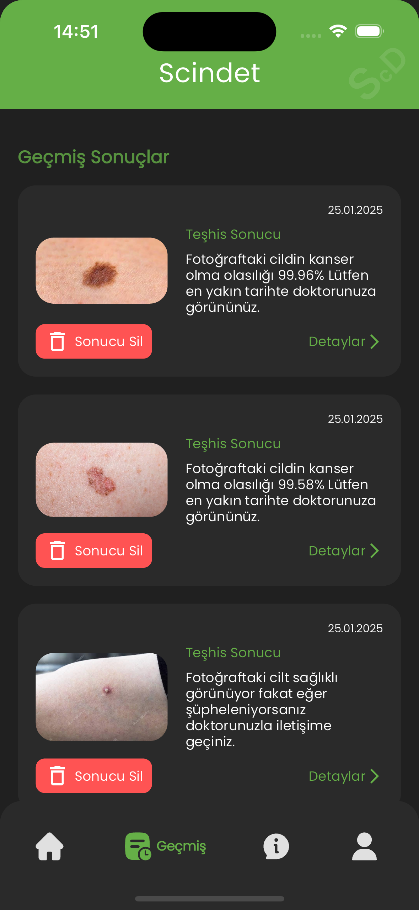
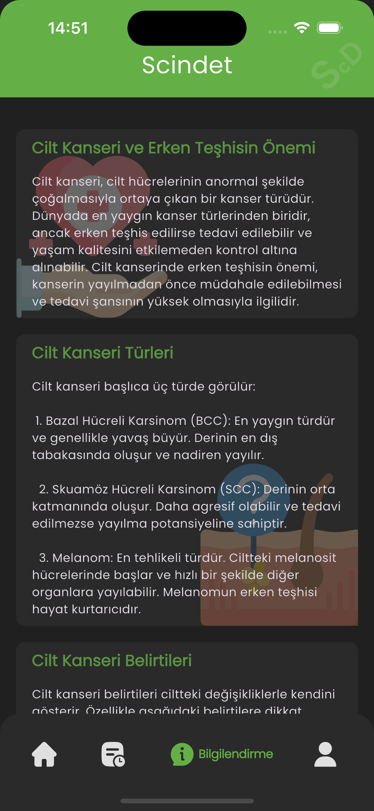
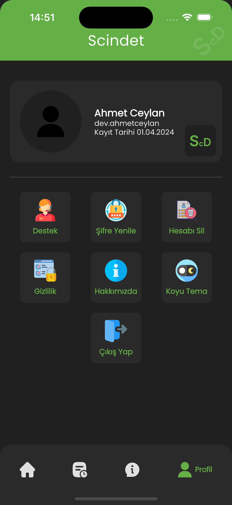

# SCINDET - AI-Powered Skin Cancer Diagnosis Mobile Application

This project aims to assist in the diagnosis of skin cancer using a deep learning model with an **accuracy of 98%**. The model, trained on the **HAM10000 dataset**, is integrated into the mobile application to function both locally on devices and in the cloud via **Firebase ML Kit**. This hybrid design ensures secure and flexible usage for users.

---

## Table of Contents
- [Features](#features)
- [Project Architecture](#project-architecture)
- [Tools Used by the System with diagram](#technologies-used)
- [Several Screenshots](#several-screenshots)

---

## 🚀 Features

- **98% Accuracy**: High-performance model trained on the HAM10000 dataset.
- **Local and Cloud-Based Model**: Backup and accessible model using Firebase ML Kit.
- **Firebase Security**: Ensures secure storage and management of user data.
- **Result History**: Users can save and review diagnosis results anytime.
- **User-Friendly Interface**: Designed to make skin cancer diagnosis accessible and straightforward.

---

## 🏗️ Project Architecture

The application architecture consists of the following layers:

### 1. **Mobile Application**
- **User Interface**: Developed using Flutter.
- **On-Device Model**: Uses TensorFlow Lite for local model inference.
- **Cloud Model**: Backed up and served via Firebase ML Kit.

### 2. **AI Model**
- **Model Training**: CNN model trained using the HAM10000 dataset.
- **Accuracy**: Achieved 98% accuracy on test data.
- **Model Format**: Converted to TensorFlow Lite for mobile compatibility.

### 3. **Backend and Firebase Services**
- **Firebase Authentication**: Handles user logins and session management.
- **Firebase Firestore**: Stores diagnosis results securely.
- **Firebase Storage**: Hosts and manages model files.

---

### 🔧 Tools Used by the System with diagram

---

###  Video Link

### Several Screenshots

 
  
  
  
  
  
  
  

